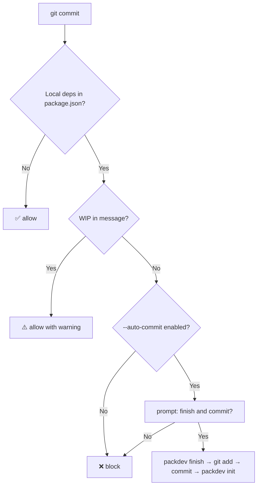

# Git Safety Hooks

Prevents accidentally committing `file:`/local-path dependencies (from `packdev init`) to your repository.

## What It Checks

Scans `package.json`'s `dependencies`, `devDependencies`, `peerDependencies`, and `optionalDependencies` for `file:` protocol values or relative paths (`./`, `../`).

## Setup

```bash
packdev setup-hooks                    # install, installed+active immediately
packdev setup-hooks --auto-commit      # install with the auto-commit flow (see below)
packdev setup-hooks --force            # overwrite existing hooks
packdev setup-hooks --disable          # remove
```

Test it:
```bash
packdev init
git commit -m "test commit"              # ❌ blocked
git commit -m "WIP: testing"             # ✅ allowed
```

## Pre-commit Flow


```mermaid
graph TD
    A[git commit] --> B{Local deps in package.json?}
    B -->|No| C[✅ allow]
    B -->|Yes| D{"WIP" in message?}
    D -->|Yes| E[⚠️ allow with warning]
    D -->|No| F{--auto-commit enabled?}
    F -->|No| G[❌ block]
    F -->|Yes| H[prompt: finish and commit?]
    H -->|No| G
    H -->|Yes| I[packdev finish → git add → commit → packdev init]
```

Implemented as `.git/hooks/pre-commit` (shell) + `.git/hooks/check-local-deps.js` (the actual check) — both local to your machine, never committed.

## Getting Past a Block

1. **Restore first (recommended)**: `packdev finish && git commit -m "..."`
2. **WIP commit**: `git commit -m "WIP: testing local package changes"` (case-insensitive, matches `wip`/`WIP`/`Work In Progress`)
3. **Temporarily disable**: `packdev setup-hooks --disable`, commit, `packdev setup-hooks` to re-enable
4. **`--auto-commit`**: see below — handles the finish/commit/init cycle for you, interactively

## Auto-Commit Flow

With `packdev setup-hooks --auto-commit`, a blocked commit prompts instead of failing outright:

```
$ git commit -m "feat: add new user authentication"

⚠️  Local file dependencies detected!
  📦 my-shared-lib: file:../shared-lib (dependencies)

🤖 Do you want to finish development and commit the changes? (y/n): y

🔄 Running packdev finish...      ✅ Dependencies restored
📦 Adding package files...        ✅ Staged
💾 Committing...                  ✅ "feat: add new user authentication"
🔄 Running packdev init...        ✅ Development environment restored
```

Your original commit message is preserved exactly; declining falls back to the normal block. The setting persists in `.packdev.json` for the whole team once committed.

## CI/CD Guard

A standalone check for pipelines that don't have `packdev` installed:

```yaml
# .github/workflows/safety-check.yml
- name: Check for local dependencies
  run: |
    node -e '
      const pkg = require("./package.json");
      const deps = { ...pkg.dependencies, ...pkg.devDependencies };
      const local = Object.entries(deps).filter(([, v]) =>
        typeof v === "string" && (v.startsWith("file:") || v.includes("../")));
      if (local.length) { console.error("Local deps found:", local.map(([n]) => n)); process.exit(1); }
    '
```

## Troubleshooting

| Problem | Fix |
|---|---|
| Hook not running | `ls -la .git/hooks/pre-commit` — should exist; if not, `packdev setup-hooks` |
| Not executable (Unix) | `chmod +x .git/hooks/pre-commit`, or `packdev setup-hooks --force` |
| Unsure if a dep would trip it | `grep -E "(file:\|\.\.\/\|\.\/)" package.json` |
| Windows | Ensure `node` is on `PATH`; works under Git Bash, PowerShell, or CMD |

## Notes

- `.git/hooks/` is never committed — each developer runs `packdev setup-hooks` locally once.
- `.packdev.json` **should** be committed (or shared per the team's convention, see [Workflow Guide](./WORKFLOW.md#team-collaboration)) so `--auto-commit` and dependency mappings stay consistent across the team.
- Always `packdev finish` before a release build — hooks only guard commits, not `npm publish`/`npm run build`.
