# PackDev Git Hooks Guide

This guide explains how to set up and use Git safety hooks to prevent accidental commits with local file dependencies when using PackDev.

## 🛡️ Safety Hook Overview

The Git safety hook prevents you from accidentally committing local file dependencies (like `"file:../my-package"`) to your repository. This is crucial for maintaining clean, production-ready code.

### What It Checks

The hook scans your `package.json` for:
- `file:` protocol dependencies
- Relative path dependencies (starting with `./` or `../`)
- Dependencies in all sections: `dependencies`, `devDependencies`, `peerDependencies`, `optionalDependencies`

## 🚀 Quick Setup

### 1. Create the Hooks

```bash
# Create the safety hooks
packdev setup-hooks

# Hooks are automatically installed in .git/hooks/ and active immediately
```

### 2. Test the Setup

```bash
# Switch to local development
packdev init

# Try to commit (should be blocked)
git add .
git commit -m "test commit"

# Commit with WIP (should be allowed)
git commit -m "WIP: testing local changes"
```

## 📋 Available Commands

### Setup Hooks
```bash
# Create new hooks
packdev setup-hooks

# Create hooks with auto-commit flow
packdev setup-hooks --auto-commit

# Overwrite existing hooks
packdev setup-hooks --force

# Enable auto-commit flow on existing hooks
packdev setup-hooks --auto-commit --force

# Remove/disable hooks
packdev setup-hooks --disable
```

## 🔧 How It Works

### Pre-commit Flow

```mermaid
graph TD
    A[Git Commit] --> B[Pre-commit Hook]
    B --> C[Check package.json]
    C --> D{Local deps found?}
    D -->|No| E[✅ Allow Commit]
    D -->|Yes| F{WIP in message?}
    F -->|Yes| G[⚠️ Allow with Warning]
    F -->|No| H{Auto-commit flow enabled?}
    H -->|No| I[❌ Block Commit]
    H -->|Yes| J[❓ Ask: Finish and commit?]
    J -->|No| I
    J -->|Yes| K[🔄 packdev finish]
    K --> L[📦 git add package.*]
    L --> M[💾 git commit]
    M --> N[🔄 packdev init]
    N --> O[✅ Complete]
```



### Hook Components

1. **`.git/hooks/pre-commit`** - Shell script that triggers the check
2. **`.git/hooks/check-local-deps.js`** - Node.js script that performs the validation

## ✅ Bypassing the Hook

There are several ways to proceed when the hook blocks your commit:

### Method 1: Restore Dependencies (Recommended)
```bash
# Restore original dependencies
packdev finish

# Now commit normally
git add .
git commit -m "implement feature X"
```

### Method 2: WIP Commits
```bash
# Add WIP to commit message
git commit -m "WIP: testing local package changes"
git commit -m "work in progress: debugging issue"
git commit -m "wip - incomplete feature"
```

### Method 3: Temporarily Disable
```bash
# Disable hooks temporarily
packdev setup-hooks --disable

# Make your commits
git commit -m "commit with local deps"

# Re-enable hooks
packdev setup-hooks
```

### Method 4: Auto-Commit Flow
```bash
# Enable auto-commit flow when setting up hooks
packdev setup-hooks --auto-commit

# Or enable on existing hooks
packdev setup-hooks --auto-commit --force
```

When auto-commit flow is enabled, the pre-commit hook will:

1. **Detect local dependencies** in your commit
2. **Ask interactively**: "Do you want to finish development and commit the changes? (y/n)"
3. **If you answer 'yes'**:
   - Run `packdev finish` to restore original dependencies
   - Run `git add package.*` to stage package files
   - Commit with your original commit message
   - Run `packdev init` to restore development environment
4. **If you answer 'no'**: Block the commit (traditional behavior)

**Benefits:**
- 🚀 **Streamlined workflow** - No need to manually run finish/init cycle
- 🔒 **Safe by default** - Always asks before proceeding
- 💾 **Preserves your commit message** - Uses exactly what you typed
- 🔄 **Automatic re-initialization** - Ready for continued development
- 💡 **Configurable** - Saved in `.packdev.json` for team consistency

**Example interaction:**
```bash
$ git commit -m "feat: add new user authentication"

⚠️  Local file dependencies detected!

  📦 my-shared-lib: file:../shared-lib (dependencies)

🤖 Do you want to finish development and commit the changes? (y/n): y

🔄 Running packdev finish...
✅ Dependencies restored
📦 Adding package files...
✅ Package files staged
💾 Committing with message: "feat: add new user authentication"
✅ Changes committed
🔄 Running packdev init...
✅ Development environment restored

🎉 Auto-commit flow completed successfully!
```

## 🎯 Use Cases

### Development Workflow
```bash
# 1. Start local development
packdev add my-utils ../shared/utils
packdev init

# 2. Make changes and test
# ... development work ...

# 3. Commit work-in-progress
git add .
git commit -m "WIP: implementing new feature with local utils"

# 4. Continue development
# ... more work ...

# 5. Finish and commit properly
packdev finish
git add .
git commit -m "implement new feature using shared utils"
```

### Team Collaboration
```bash
# Share WIP branch with team
git checkout -b feature/new-ui
packdev init
git commit -m "WIP: initial UI components with local deps"
git push origin feature/new-ui

# Later, clean up before merge
packdev finish
git add .
git commit -m "finalize UI components"
git push origin feature/new-ui
```

## 📊 Hook Behavior Examples

### ✅ Allowed Commits

```bash
# No local dependencies
git commit -m "fix bug in authentication"

# WIP commits with local deps
git commit -m "WIP: testing new features"

# After restoring dependencies
packdev finish
git commit -m "add new utility functions"
```

### ❌ Blocked Commits

```bash
# Local deps without WIP
git commit -m "add new features"  # BLOCKED

# Case-sensitive WIP check passes
git commit -m "Work In Progress: testing"  # ALLOWED
git commit -m "wip testing"  # ALLOWED
```

## 🔍 Troubleshooting

### Hook Not Running
```bash
# Check if hooks are installed
ls -la .git/hooks/pre-commit

# Should show the packdev hook file
```

### Permission Issues (Unix/Linux/macOS)
```bash
# Make hook executable
chmod +x .git/hooks/pre-commit

# Or recreate with proper permissions
packdev setup-hooks --force
```

### Hook Running But Not Working
```bash
# Test the check script directly
node .git/hooks/check-local-deps.js

# Check if package.json has local deps
grep -E "(file:|\.\.\/|\.\/)" package.json
```

### Windows Compatibility
```bash
# On Windows, ensure Node.js is in PATH
where node

# The hook should work with Git Bash, PowerShell, or CMD
```

## ⚙️ Configuration

### Git Configuration
```bash
# Hooks are installed in standard .git/hooks/ directory
# No additional configuration needed

# Check if hooks are installed
ls -la .git/hooks/pre-commit
```

### Customizing the Check
The generated hook script can be modified if needed:

```javascript
// In .git/hooks/check-local-deps.js
// Modify the WIP pattern
const wipPattern = /\b(wip|draft|temp)\b/i;

// Add exclusions
const excludePackages = ['@my-org/dev-tools'];
```

## 🏢 Team Setup

### Repository Setup
```bash
# 1. One team member sets up hooks
packdev setup-hooks
# Note: .git/hooks/ is not committed to git

# 2. Other team members just run:
packdev setup-hooks
# Each developer installs hooks locally
```

### CI/CD Integration
```yaml
# .github/workflows/safety-check.yml
name: Safety Check
on: [push, pull_request]
jobs:
  check-deps:
    runs-on: ubuntu-latest
    steps:
      - uses: actions/checkout@v3
      - uses: actions/setup-node@v3
        with:
          node-version: '18'
      - name: Check for local dependencies
        run: |
          # Create a temporary check script for CI
          cat > check-deps.js << 'EOF'
          const fs = require('fs');
          const packageJson = JSON.parse(fs.readFileSync('package.json', 'utf8'));
          const deps = {...(packageJson.dependencies || {}), ...(packageJson.devDependencies || {})};
          const localDeps = Object.entries(deps).filter(([_, version]) => 
            typeof version === 'string' && (version.startsWith('file:') || version.includes('../'))
          );
          if (localDeps.length > 0) {
            console.log('❌ Local dependencies found:', localDeps.map(([name]) => name));
            process.exit(1);
          }
          console.log('✅ No local dependencies found');
          EOF
          node check-deps.js
```

## 📝 Best Practices

### 1. Always Use Descriptive WIP Messages
```bash
# ❌ Not descriptive
git commit -m "WIP"

# ✅ Descriptive
git commit -m "WIP: implementing user authentication with local auth-lib"
```

### 2. Clean Up Before Final Commits
```bash
# Before merging or releasing
packdev finish
npm install  # Ensure all deps are properly installed
npm test     # Verify everything works
git commit -m "finalize feature implementation"
```

### 3. Document Local Dependencies
```bash
# In commit messages
git commit -m "WIP: testing with local @myorg/utils v2.1.0-beta"

# In pull request descriptions
echo "Note: This PR uses local dependencies for testing purposes"
```

### 4. Use Branches for Local Development
```bash
# Create feature branch
git checkout -b feature/local-testing

# Work with local deps
packdev init
git commit -m "WIP: initial implementation"

# Clean up in separate commit
packdev finish
git commit -m "clean up dependencies"
```

## 🔄 Migration from Other Hook Systems

### From Husky
```bash
# Remove husky
npm uninstall husky

# Remove .husky directory
rm -rf .husky

# Setup packdev hooks
packdev setup-hooks
```

### From pre-commit (Python)
```bash
# Remove .pre-commit-config.yaml
rm .pre-commit-config.yaml

# Setup packdev hooks
packdev setup-hooks
```

## 🚨 Important Notes

### Production Safety
- **Never deploy** code with `file:` dependencies to production
- Always run `packdev finish` before creating release builds
- Use CI/CD checks to catch any missed local dependencies

### Version Control
- **Don't commit** hook files (`.git/hooks/` is local to each developer)
- **Do commit** `.packdev.json` to share configuration with your team
- **Each team member** should run `packdev setup-hooks` to install hooks locally
- **Include** hook setup in your project's README

### Team Coordination
- **Communicate** when using local dependencies in shared branches
- **Document** which packages have local overrides
- **Coordinate** local dependency versions across team members

---

## Summary

The GitHub safety hooks provide an essential safety net for teams using `packdev`. They prevent accidental commits of local dependencies while allowing flexibility for development workflows through WIP commits and easy bypass mechanisms.

For more information, see:
- [PACKAGING.md](./PACKAGING.md) - Complete packaging guide
- [YARN-SUPPORT.md](./YARN-SUPPORT.md) - Yarn-specific instructions
- [README.md](../README.md) - Main project documentation
